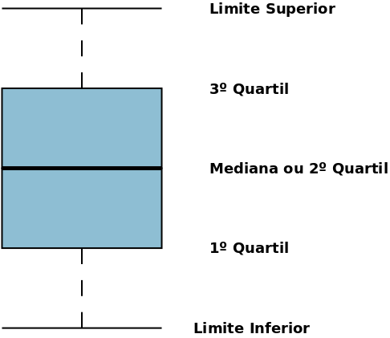
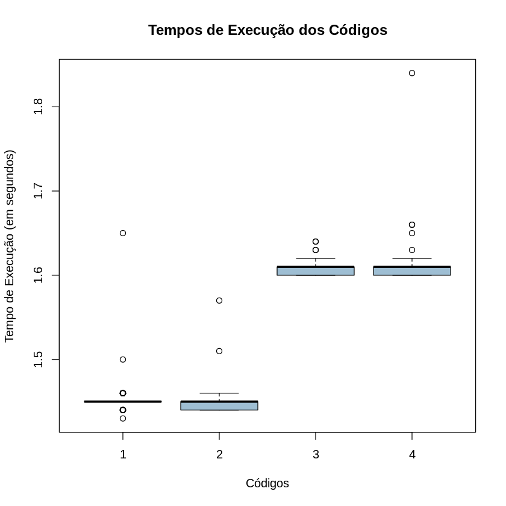
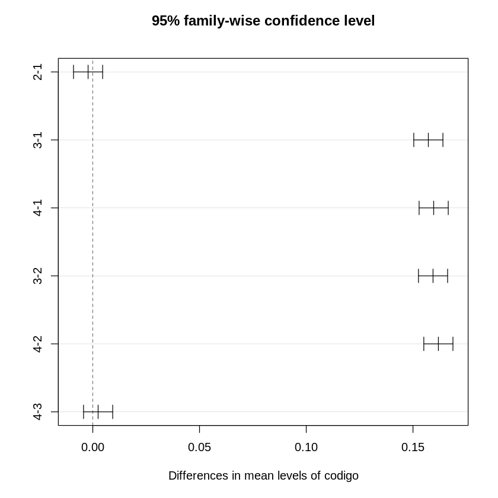
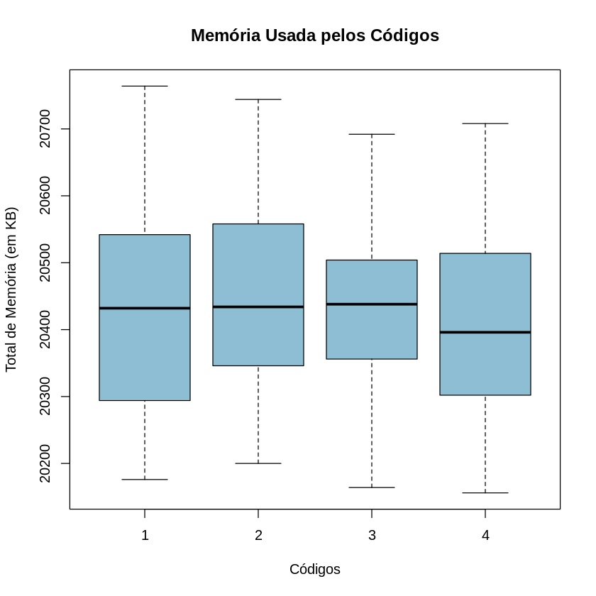
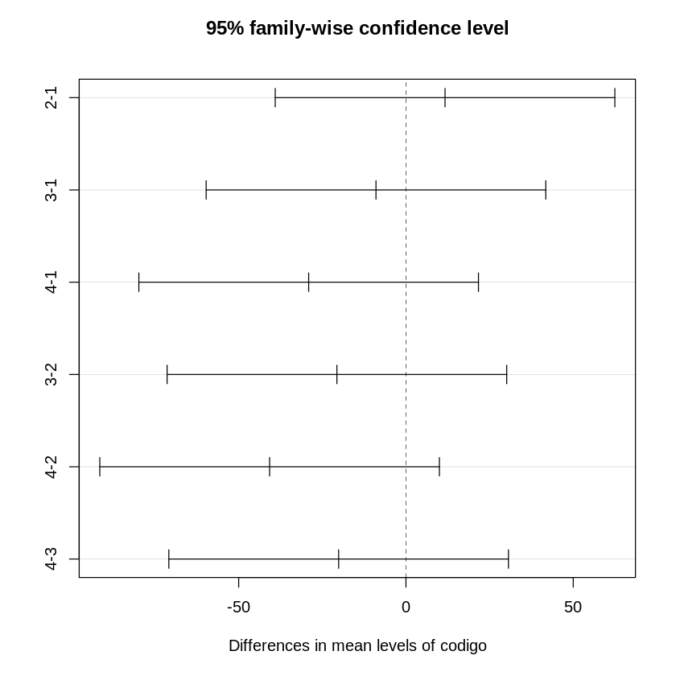

+++
title = "PHP: Interpretação de variáveis em string ou concatenação?"

[taxonomies]
tags = ["php", "desempenho"]
+++

Na live do [pokemaobr](https://www.twitch.tv/pokemaobr), durante o desenvolvimento de uma funcionalidade do bot, ocorreu uma discussão a respeito de usar [interpretação de variáveis dentro da string](https://www.php.net/manual/pt_BR/language.types.string.php#language.types.string.parsing) ou concatenar, tanto em relação a desempenho, quanto legibilidade. Eu fiquei curioso em relação ao desempenho, então resolvi fazer alguns testes estatísticos para verificar isso.

## Experimento

Para fazer um teste estatístico, o primeiro passo é adquirir os dados. Para esse caso, bastaria implementar as diferentes opções e medir o desempenho de cada uma. Então fiz um código que gere uma string a partir de 10 variáveis, repetindo a instrução que gera a string 1 milhão de vezes, o que faz com que a execução do código leve um tempo razoável para ser medido. Então a estrutura do experimento ficou assim:

```php
<?php

$a = 1;
$b = 2;
$c = 3;
$d = 4;
$e = 5;
$f = 6;
$g = 7;
$h = 8;
$i = 9;
$j = 10;

for ($k = 0; $k < 1000000; $k++) {
    # Código que gera a string
}
```

A primeira opção a ser testado é a [interpretação simples de variáveis](https://www.php.net/manual/pt_BR/language.types.string.php#language.types.string.parsing.simple), que consiste em usar as variáveis diretamente entre aspas duplas ([código completo](codigo1.php)):

```php
$str = "$a $b $c $d $e $f $g $h $i $j";
```

A segunda opção é a [interpretação complexa de variáveis](https://www.php.net/manual/pt_BR/language.types.string.php#language.types.string.parsing.complex), que é semelhante a primeira, porém coloca a variável entre chaves (`{}`) ([código completo](codigo2.php)):

```php
$str = "{$a} {$b} {$c} {$d} {$e} {$f} {$g} {$h} {$i} {$j}";
```

A terceira opção é a concatenação de strings utilizando aspas duplas ([código completo](codigo3.php)):

```php
$str = $a . " " . $b . " " . $c . " " . $d . " " . $e . " " . $f . " " . $g . " " . $h . " " . $i . " " . $j;
```

E a quarta e última opção é a concatenação de strings utilizando aspas simples ([código completo](codigo4.php)):

```php
$str = $a . ' ' . $b . ' ' . $c . ' ' . $d . ' ' . $e . ' ' . $f . ' ' . $g . ' ' . $h . ' ' . $i . ' ' . $j;
```

Ainda é necessário uma forma de medir o desempenho desses códigos. Por ter optado em executá-los diretamente no terminal (para não ter interferência de algum servidor web, por exemplo), é possível medir o desempenho do processo diretamente. Uma ferramenta que faz isso é o [GNU Time](https://www.gnu.org/software/time/), que pode ser instalado no [Debian](https://www.debian.org/) com `apt install time`. Porém o [Bash](https://www.gnu.org/software/bash/) também possui um comando interno chamado `time`, sendo necessário informar o caminho completo do executável (`/usr/bin/time`) para que ele seja executado, em vez do comando interno do Bash.

Para facilitar o processo de análise, criei um shell script ([run.sh](run.sh)) que executa cada código alternadamente 100 vezes, gerando uma boa quantidade de dados para que possa ser feita uma análise estatística, e de forma que outros processos que executem durante algum teste não interfira tanto nos resultados. A saída do script é um [CSV](https://pt.wikipedia.org/wiki/Comma-separated_values) com os valores medidos, semelhante aos `.txt` utilizados pelo bot já citado. Porém também comprimi o arquivo com [Gzip](https://www.gzip.org/) para reduzir o tamanho do mesmo, embora não fosse realmente necessário para essa pequena base, mas isso é bastante feito para bases CSV grandes, visto a boa taxa de compressão para arquivos de texto, que é o caso do CSV, economizando alguns *gigabytes* em muitos casos. O resultado final está disponível [aqui](dados.csv.gz).

A versão do PHP utilizada foi a 7.3.19-1~deb10u1, que é a versão mais recente disponível no repositório *stable* do Debian, que estava na versão 10.7 (Buster) no dia da escrita desse artigo.

## Análise do tempo de execução

Para fazer a análise, optei por utilizar a linguagem [R](https://www.r-project.org/), que é voltada para estatísticas, dentro de um notebook do [Jupyter](https://jupyter.org/), que facilita a execução e replicação dos testes, podendo ser acessado [aqui](analise.ipynb) (ou visualizado [aqui](https://github.com/eduardoklosowski/blog/blob/main/content/2020-12-29-php-interpretacao-concatenacao/analise.ipynb)).

Para visualizar os dados foi escolhido o [*boxplot*](https://pt.wikipedia.org/wiki/Diagrama_de_caixa), que consiste em um gráfico como qualquer outro, porém em vez de um ponto no plano cartesiano, apresenta a figura a baixo. Essa figura indica qual é o maior e menor valor, mediana (50% dos dados estão a baixo dessa linha e 50% a cima), 1º quartil (25% dos dados estão a baixo dessa linha e 75% a cima) e 3º quartil (75% dos dados estão a baixo dessa linha e 25% dos dados estão a cima). Essas linhas podem estar mais próximas ou distantes conforme a distribuição dos valores representado pelo *boxplot*. A aparição de algum ponto, além da figura do *boxplot*, representa um [*outlier*](https://pt.wikipedia.org/wiki/Outlier), que é um valor bastante diferente dos demais, neste caso, o mais provável é que alguma outra coisa executou no computador e interferiu na execução do código a ser testado.



A baixo está o *boxplot* do tempo de execução dos diferentes códigos implementados:



É possível observar uma tendência de tempo menor nas implementações de interpretação de variáveis que nas implementações com concatenação, provavelmente devido a essas últimas precisarem fazer várias operações de concatenações, que por sua vez podem gerar diferentes strings intermediárias. Na linguagem Java, por exemplo, existe a classe [`String`](https://docs.w3cub.com/openjdk~11/java.base/java/lang/string), e a classe [`StringBuilder`](https://docs.w3cub.com/openjdk~11/java.base/java/lang/stringbuilder), que é semelhante a primeira, porém mutável, sendo muito mais rápida para fazer diversas concatenações, uma vez que não precisa gerar diversas strings intermediárias, e depois pode ser convertida para uma [`String`](https://docs.w3cub.com/openjdk~11/java.base/java/lang/string) propriamente dita.

Para verificar se essas diferenças nos tempos de execução é estatisticamente significativa, é possível aplicar um teste [ANOVA](https://pt.wikipedia.org/wiki/An%C3%A1lise_de_vari%C3%A2ncia):

```txt
             Df Sum Sq Mean Sq F value Pr(>F)
codigo        3 2.5462  0.8487    2425 <2e-16 ***
Residuals   396 0.1386  0.0003
---
Signif. codes:  0 ‘***’ 0.001 ‘**’ 0.01 ‘*’ 0.05 ‘.’ 0.1 ‘ ’ 1
```

O teste apresenta um valor P bastante significativo (`Pr` na tabela a cima), indicando que existem diferenças estatisticamente significativas. Para encontrar que diferenças são essas, é possível aplicar um teste de [Tukey](https://en.wikipedia.org/wiki/Tukey%27s_range_test). Uma forma de representá-lo é através de um gráfico com intervalos das diferenças entre os valores medidos, onde as diferenças estatisticamente significativas não incluirão o 0 no intervalo. A baixo esse gráfico com [nível de confiança](https://pt.wikipedia.org/wiki/Intervalo_de_confian%C3%A7a) de 95% (para entender mais sobre nível ou intervalo de confiança recomendo esse [vídeo](https://www.youtube.com/watch?v=GsnnsmZAi5Y), e lembrar um pouco da [unnskyld2](https://www.twitch.tv/unnskyld2) também):



Esse gráfico demonstra que existem diferenças estatisticamente significativas entre as implementações com interpretação de variáveis das com concatenação, porém entras as implementações de interpretação de variáveis e entre as com concatenação não foi encontrado diferenças estatisticamente significativas, não sendo possível afirmar qual entre cada grupo é a melhor, se é existe diferença de desempenho.

## Uso de memória RAM

Outra coisa que também foi medido pelo `time` é o uso de memória RAM. Repetindo o processo efetuado com o tempo de execução, temos o *boxplot*:



Nesse gráfico não é possível verificar nenhuma grande diferença de uso de memória entre as implementações, o que é corroborado pelo teste ANOVA, que também não apresenta diferenças, com valor P (0.206) a cima de 0.05 (valor usado para o intervalo de confiança de 95%).

```txt
             Df  Sum Sq Mean Sq F value Pr(>F)
codigo        3   88864   29621   1.531  0.206
Residuals   396 7663691   19353
```

Como não foi encontrado diferenças estatisticamente significativas, não é necessário aplicar o teste de Tukey. Mas por curiosidade, segue a baixo:



## Considerações

Em relação a discussão inicial, este texto verifica apenas a questão do desempenho, não abordando a questão de legibilidade. Dentro da questão de desempenho, foi verificado que a utilização de interpretação de variável é mais rápida que a concatenação, e essa diferença é estatisticamente significativa. Porém não foi observado nenhuma diferença em relação ao uso de memória RAM, tendo a diferença se restringindo ao tempo de execução.
