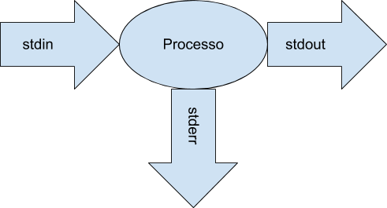
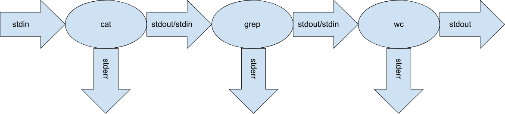
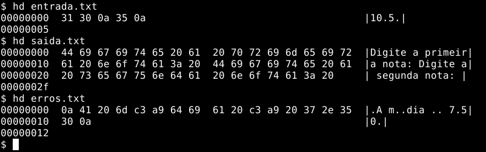
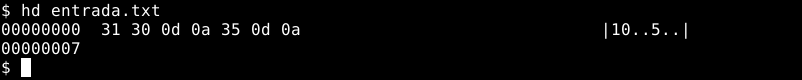

+++
title = "Formatação para o URI"

[taxonomies]
tags = ["processos"]
linguagens = ["c", "javascript"]
+++

A [levxyca](https://www.twitch.tv/levxyca) estava resolvendo exercícios do [URI](https://www.urionlinejudge.com.br/) em live, e teve alguma dificuldade, não com o exercício, mas com a leitura da entrada e a formatação da saída. Então resolvi descrever um pouco esse processo, que pode ajudar tanto quem for resolver os desafios do URI, como também quem deseja entender mais sobre o funcionamento dos processos em si.

## Fluxos padrões do processo

O primeiro passo é entender como funcionam as entradas e saídas dos processos. Em sistemas UNIX (que provavelmente é o ambiente onde o URI valida os códigos enviados) todos os processos possuem três fluxos padrões: `stdin` (*standart input stream*, fluxo de entrada padrão) que por padrão é o teclado, `stdout` (*standart output stream*, fluxo de saída padrão) que por padrão é a tela, e `stderr` (*standart error stream*, fluxo de erro padrão) que por padrão também é a tela. Exemplificado como a baixo:



No Linux eles também podem ser visualizados dentro do diretório de dispositivos (`/dev`) com `ls -la /dev/std{in,out,err}`:

```txt
lrwxrwxrwx 1 root root 15 fev  6 10:07 /dev/stderr -> /proc/self/fd/2
lrwxrwxrwx 1 root root 15 fev  6 10:07 /dev/stdin -> /proc/self/fd/0
lrwxrwxrwx 1 root root 15 fev  6 10:07 /dev/stdout -> /proc/self/fd/1
```

Esse comando apresenta uma informação interessante, eles são *links* simbólicos para `/proc/self/fd/*`, onde `/proc` é o diretório com informações sobre os processos, `self` é referente ao processo atual, `fd` são [*file descriptor*](https://pt.wikipedia.org/wiki/Descritor_de_arquivo), que nada mais são que arquivos abertos pelo processo, numerados de 0, 1 e 2. Quando se usa um comando como `grep eduardo < entrada.txt > saida.txt 2> erros.txt`, manipula-se o `stdin` para ler do arquivo `entrada.txt` em vez do teclado, o `stdout` para escrever no arquivo `saida.txt` em vez da tela, e o `stderr` para escrever no arquivo `erros.txt`. Esse comando também poderia ser escrito como `grep eduardo 0< entrada.txt 1> saida.txt 2> erros.txt`, ou seja, os comandos `<` (ou `0<`), `>` (ou `1>`) e `2>` manipulando os *file descriptors* 0, 1 e 2 do processo, inclusive é possível abrir outros arquivos, como `3<` para abrir um arquivo como leitura ou `3>` como escrita.

Também é possível ligar o `stdout` de um processo com o `stdin` de outro, como `cat < entrada.txt | grep eduardo | wc -l > saida.txt`:



Assim a entrada do primeiro processo é o arquivo `entrada.txt`, a saída do primeiro processo é ligado na entrada do segundo, e a saída do segundo é ligado na entrada do terceiro, e a saída do terceiro é ligado ao arquivo `saida.txt`. Também vale observar que como o `stderr` não é tratado, qualquer mensagem que um processo mandar para ele, será exibido na tela, e não encaminhado para o processo seguindo ou arquivo `saida.txt`. Porém seria possível mandar as mensagens do `stderr` junto no `stdout` para o próximo processo ou arquivo com `cat < entrada.txt |& grep eduardo |& wc -l &> saida.txt`.

## Fluxos dentro do processo

Quem já programou em C, provavelmente já usou as funções `printf` e `scanf`, usadas respectivamente para escrever na tela e ler do teclado. Na verdade o que essas funções fazem é escrever no `stdout` e ler do `stdin`. Para quem já manipulou arquivos, provavelmente usou as funções `fprintf` e `fscanf`, que fazem o mesmo das funções já descritas, porém escrevendo e lendo de um arquivo aberto anteriormente, porém é possível em vez de passar a referência a um arquivo (*file descriptor*), informar `stdout`, `stderr` e `stdin`, exemplo:

```c
#include <stdio.h>

int main(int argc, char *argv[]) {
    int nota1, nota2;
    float media;

    printf("Digite a primeira nota: ");
    scanf("%d", &nota1);

    fprintf(stdout, "Digite a segunda nota: ");
    fscanf(stdin, "%d", &nota2);

    media = (nota1 + nota2) / 2.0;
    fprintf(stderr, "\nA média é %.2f\n", media);

    return 0;
}
```

Entretanto algumas funções do C, como `puts` que recebe um ponteiro de `char` e imprime na tela, pulando linha ao final, é diferente da função `fputs` que recebe um arquivo e um ponteiro de `char`, mas não pula linha (mais informações sobre essas funções podem ser consultadas [aqui](https://cplusplus.com/reference/cstdio/)). Algo semelhante à diferença que existe nas funções `System.out.println` e `System.out.print` do Java (presentes na classe [`PrintStream`](https://docs.oracle.com/en/java/javase/15/docs/api/java.base/java/io/PrintStream.html)), onde a primeira pula linha ao final e a segunda não. De forma geral, algumas linguagens e bibliotecas trazem mais facilidades para tratar entradas de dados e formatar a saída que outras.

Entretanto formatações como abaixo, referente a execução do código a cima, são só visuais.

```txt
Digite a primeira nota: 10
Digite a segunda nota: 5

A média é 7.50
```

Nesse exemplo estão misturados na tela o `stdin`, o `stdout` e o `stderr`, visto que para facilitar a digitação, normalmente é feito um eco do que é digitado na tela. Gerando um arquivo `entrada.txt` com o conteúdo:

```txt
10
5
```

E executado algo como `./programa < entrada.txt > saida.txt 2> erros.txt`, no arquivo `saida.txt` teria:

```txt
Digite a primeira nota: Digite a segunda nota:
```

E no arquivo `erros.txt` teria:

```txt

A média é 7.50
```

Repare que o `saida.txt` não tem uma quebra da linha no final do arquivo, e `erros.txt` começa com uma linha em branco. Na verdade, a quebra de linha é um caractere como outro qualquer, porém o sistema, em vez de mostrar algo, ele pula para a linha de baixo naquele ponto. Entretanto existem diferenças nas formas como o Windows e sistemas UNIX fazem essa quebra de linha. Em sistemas UNIX é usado o caractere `\n`, enquanto no Windows são usados os caracteres `\r\n` também para pular uma única linha. Um visualizador hexadecimal, como o `hexdump` (ou seu alias `hd`), que mostra na primeira coluna o endereço dos bytes do arquivo, no centro a representação em hexadecimal dos arquivos, e no final a representação [ASCII](https://pt.wikipedia.org/wiki/ASCII) desses bytes, permite uma visão mais detalhada desses arquivos, onde `0a` é a representação do `\n`:



Entretanto, se o arquivo de entrada for feito no Windows (ou configurado o editor para isso), a quebra de linha seria feita com `\r\n`, veja esse exemplo (onde `0d` representa o `\r`):



Perceba que os dois arquivos `entrada.txt` possuem conteúdos diferentes, apesar de semelhantes. Essa diferença pode gerar resultados diferentes dependendo do que o programa espera tratar na entrada, por exemplo o [JavaScript](https://developer.mozilla.org/pt-BR/docs/Web/JavaScript), como é sugerido pelo próprio URI:

```js
var input = require('fs').readFileSync('/dev/stdin', 'utf8');
var lines = input.split('\n');
```

Onde `input` seria uma string com todo o conteúdo recebido pelo `stdin`, e `lines` um array onde cada elemento seria o conteúdo de uma linha, porém como o método `split` está sendo executado sobre o caractere `\n`, caso o formato utilizado seja o do Windows, cada posição do array teria um `\r` no final, com exceção da última linha, o que poderia gerar problemas ao tentar converter essas string para número, visto que existe um caractere que não é numérico na string (o que seria necessário para a entrada que vem sendo utilizada até aqui, visto que a operação `+` no JavaScript com strings é a concatenação e não a soma matemática). O mesmo pode ocorrer na saída do programa, um `\r` poderia gerar uma saída diferente, assim como a falta da quebra de linha no final da saída, impossibilitando a leitura correta do arquivo por um processo automatizado, por exemplo.

## Simulando o URI

Basicamente o que o URI faz é interagir com o programa que foi submetido para ele através do `stdin` e `stdout`, o que facilita o suporte a várias linguagens que eles possuem, e até onde eu já vi, considerando o formato de quebra de linha do UNIX (`\n`). Sendo possível gerar arquivos com os exemplos de entradas na descrição dos problemas ou presentes em sites como [uDebug](https://www.udebug.com/), e executado com `./programa < entrada.txt > saida.txt` ou `node programa.js < entrada.txt > saida.txt` para ler essa entrada e gerar um arquivo contendo a saída do programa, que pode ser comparada com o comando `diff` para verificar as diferenças com o exemplo de saída esperada (exemplo: `diff saida.txt esperado.txt`). Embora isso possa ser trabalhoso para programas pequenos, conforme a complexidade dos problemas aumentem, e com diversos casos a serem testados, isso pode facilitar bastante, principalmente os exemplos do uDebug, cobrindo algum caso especial que não foi coberto pelos exemplos do próprio URI.

Uma recomendação minha é utilizar o [EditorConfig](https://editorconfig.org/) para facilitar a configuração do seu editor. Basta instalar o plugin, se o seu editor não tiver o suporte nativo, e ele lerá o arquivo `.editorconfig` quando aberto, já aplicando a configuração correta para formatar os arquivos, que podem ser diferentes para cada projeto, inclusive optando entre tab e espaço (quantidade de espaços também). A configuração mínima que recomendo para esse caso é:

```ini
root = true

[*]
end_of_line = lf
trim_trailing_whitespace = true
insert_final_newline = true
```

Assim é usado o formato do UNIX (`lf` ou *line feed* é o nome do caractere `\n`), ele terminará sempre o arquivo com uma quebra de linha, e remover os espaços em branco no final das linhas, que também podem fazer diferença, e nem sempre são tão visíveis.

## Considerações

Muitas vezes a maior dificuldades das pessoas com o URI, não são seus problemas, mas seguir corretamente e de forma precisa a formatação da saída, e tratar e converter os dados na entrada, visto que muitas vezes é necessário converter de string para inteiro, e esses caracteres não visíveis podem causar diversos erros, ou funcionar no computador com Windows, uma vez que é possível fazer o programa esperar que a entrada tenha `\r\n` como quebra de linhas, mas não rodar corretamente na hora do URI validar a resposta, uma vez que eles lidam com formatos diferentes de entrada.
