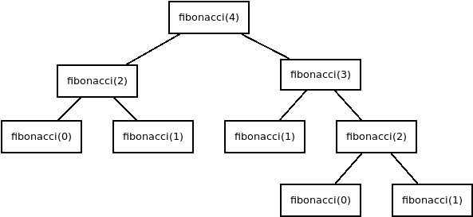
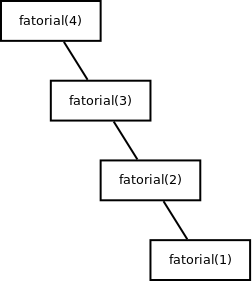
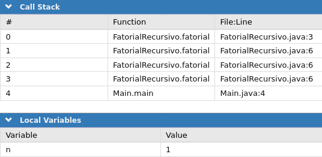
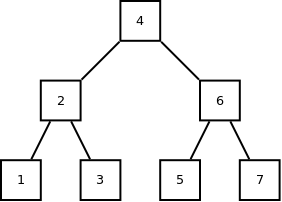

+++
title = "Complexidade do algoritmo em relação à memória"

[taxonomies]
tags = ["Desempenho", "Otimização", "Code Style"]
linguagens = ["Java"]
+++

Recentemente o [ProfBrunoLopes](https://www.twitch.tv/profbrunolopes) fez uma live com a [morgiovanelli](https://www.twitch.tv/morgiovanelli) falando sobre a complexidade dos algoritmos, onde era discutido, de forma matemática, como identificar qual algoritmo era mais eficiente dado o crescimento de seu tempo de execução em relação ao tamanho da entrada. Nesse texto, quero expandir essa análise para outros aspectos, como o uso de memória.

## Complexidade da função `fibonacci`

Como uma breve revisão, será feita a análise da complexidade do tempo de execução de algoritmos para o cálculo de valores da [sequência de Fibonacci](https://pt.wikipedia.org/wiki/Sequ%C3%AAncia_de_Fibonacci), que é uma sequência onde os dois primeiros valores são 1, e os demais é a soma dos dois valores anteriores. Um exemplo de algoritmo que faz esse cálculo usando recursividade é:

```java
public class FibonacciRecursivo {
    public static int fibonacci(int n) {
        if (n <= 1) {
            return n;
        }
        return fibonacci(n - 2) + fibonacci(n - 1);
    }
}
```

Todas as instruções dessa função, menos as chamadas recursivas, tem complexidade constante (`O(1)`), ou seja, o tempo de execução dessas instruções não variam conforme a posição a ser calculada (tamanho da entrada). Em relação a complexidade das chamadas recursivas, é possível verificar que cada chamada, executa novamente a função outras duas vezes (menos quando atinge o caso base), reduzindo o tamanho do problema a ser resolvido em uma e duas unidades, gerando algo parecido com o diagrama a baixo:



Dessa forma é possível dizer que a complexidade desse algoritmo é exponencial (`O(2^n)`), visto que a chamada recursiva não altera a grandeza do tamanho do problema a ser resolvido a cada chamada. E devido a sua complexidade exponencial, esse algoritmo é considerado ineficiente para grandes valores.

Porém uma vez que um valor da sequência de Fibonacci foi calculado, ele pode ser guardado em memória e reutilizado, em vez de precisar calculá-lo toda vez. E é necessário saber apenas os últimos dois valores da sequência para se calcular o próximo. Assim pode-se implementar um algoritmo iterativo (que itera, utiliza um laço de repetição), como:

```java
public class FibonacciIterativo {
    public static int fibonacci(int n) {
        if (n == 0) {
            return 0;
        }

        int a = 0;
        int b = 1;

        for (int i = 1; i < n; ++i) {
            int aux = a + b;
            a = b;
            b = aux;
        }

        return b;
    }
}
```

Nesse algoritmo, assim como o anterior, todas as instruções possuem complexidade constante, com exceção do laço de repetição, que faz o seu bloco interno ser executado `n - 1` vezes. Dessa forma esse algoritmo possui complexidade linear (`O(n)`, visto que seriam `n - 1` vezes um bloco de complexidade `O(1)`), sendo bem mais eficiente que a opção anterior.

## Complexidade da função `fatorial`

Outro problema que pode ser analisado é o cálculo do [fatorial](https://pt.wikipedia.org/wiki/Fatorial) de um número. O fatorial de um número é a multiplicação dele por todos os seus antecessores até o 1, ou simplesmente a multiplicação de um número pelo fatorial do seu antecessor, sendo que o fatorial de 1 é 1. Exemplo:

```txt
4! = 4 * 3!
4! = 4 * 3 * 2!
4! = 4 * 3 * 2 * 1!
4! = 4 * 3 * 2 * 1
```

Novamente é possível implementar um algoritmo que resolva esse problema usando recursividade:

```java
public class FatorialRecursivo {
    public static int fatorial(int n) {
        if (n <= 1) {
            return 1;
        }
        return n * fatorial(n - 1);
    }
}
```

Onde as chamadas recursivas geram algo parecido com o diagrama a baixo:



Vale observar que novamente todas as instruções possuem complexidade constante, menos as chamadas recursivas, que por sua vez, chama a função mais uma vez, com um problema de tamanho com uma unidade a menos, o que repete a função o mesmo número de vezes do fatorial a ser calculado, portando possui complexidade linear.

Também é possível fazer um algoritmo iterativo para resolver esse problema, como:

```java
public class FatorialIterativo {
    public static int fatorial(int n) {
        int fatorial = 1;

        for (int i = 2; i <= n; ++i) {
            fatorial *= i;
        }

        return fatorial;
    }
}
```

Nesse código é possível identificar o laço de repetição executando `n - 1` vezes seu bloco de código de complexidade constante, fazendo com que esse algoritmo tenha complexidade linear em seu tempo de execução.

Embora que para esse problema, tanto o algoritmo recursivo, quanto o algoritmo iterativo apresentem a mesma complexidade no tempo de execução, os dois algoritmos possuem diferenças em relação ao uso de memória. Enquanto o algoritmo iterativo utiliza apenas três variáveis (uma do argumento da função e duas no código), a versão recursiva usa uma só (argumento da função), porém isso se repete para cada chamada da função, e como isso fica em memória até que a última função seja chamada, essa variável chega a existir `n` vezes na memória ao mesmo tempo, uma em cada contexto da função, como no exemplo de execução do [GDB online Debugger](https://www.onlinegdb.com/):



Dessa forma é possível dizer que existe uma diferença na complexidade desses código em relação ao uso de memória, com o algoritmo recursivo usando memória de forma linear ao tamanho da entrada, e a versão iterativa usando memória de forma constante. E essa análise tem o mesmo resultado se feita nos algoritmos para o cálculo da sequência de Fibonacci.

## Complexidade para se percorrer uma árvore

É possível armazenar dados em uma estrutura que recebe o nome de [árvore binária](https://pt.wikipedia.org/wiki/%C3%81rvore_bin%C3%A1ria), que consiste em organizar todos os valores menores que um determinado valor a esquerda, e todo os valores maiores a direita, formando algo que lembra uma árvore com ramificações. Exemplo:



É possível utilizar recursividade para percorrer em ordem crescente essa árvore e imprimir na tela seus valores. Exemplo:

```java
class ArvoreValor {
    ArvoreValor esquerda;
    int valor;
    ArvoreValor direita;

    public ArvoreValor(ArvoreValor esquerda, int valor, ArvoreValor direita) {
        this.esquerda = esquerda;
        this.valor = valor;
        this.direita = direita;
    }
}

public class ArvoreRecursiva {
    private ArvoreValor raiz;

    public ArvoreRecursiva() {
        raiz = new ArvoreValor(
            new ArvoreValor(
                new ArvoreValor(null, 1, null),
                2,
                new ArvoreValor(null, 3, null)
            ),
            4,
            new ArvoreValor(
                new ArvoreValor(null, 5, null),
                6,
                new ArvoreValor(null, 7, null)
            )
        );
    }

    private void printAux(ArvoreValor valor) {
        if (valor == null) {
            return;
        }

        printAux(valor.esquerda);
        System.out.println(valor.valor);
        printAux(valor.direita);
    }

    public void print() {
        printAux(raiz);
    }
}
```

Nesse caso foram criadas duas funções, a `printAux` que percorre a árvore de forma recursiva, e a `print` que expõe essa função, para ser chamada externamente de forma mais simples. Em relação ao tempo de execução, esse algoritmo possui complexidade linear, uma vez que percorre todos os valores da árvore, e em relação ao uso de memória, como só é necessário manter as variáveis de um ramo da árvore por vez em memória, ele cresce de forma logarítmica em relação a quantidade de valores da árvore (`O(log2 n)`), igual a altura da árvore, considerando que a mesma esteja balanceada (com ramos aproximadamente do mesmo tamanho).

É possível pensar em um algoritmo iterativo para esse problema. Porém como deve-se passar uma vez pelos valores a esquerda e outra pelos valores a direita de cada valor da árvore, para controlar o estado e saber qual lado deve-se percorrer, cria-se uma estrutura com essa informação. Exemplo:

```java
import java.util.ArrayList;
import java.util.List;

class ArvoreValor {
    ArvoreValor esquerda;
    int valor;
    ArvoreValor direita;

    public ArvoreValor(ArvoreValor esquerda, int valor, ArvoreValor direita) {
        this.esquerda = esquerda;
        this.valor = valor;
        this.direita = direita;
    }
}

enum ArvoreLado {
    Esquerda,
    Direita;
}

class Estado {
    ArvoreValor valor;
    ArvoreLado lado;

    public Estado(ArvoreValor valor, ArvoreLado lado) {
        this.valor = valor;
        this.lado = lado;
    }
}

public class ArvoreIterativa {
    private ArvoreValor raiz;

    public ArvoreIterativa() {
        raiz = new ArvoreValor(
            new ArvoreValor(
                new ArvoreValor(null, 1, null),
                2,
                new ArvoreValor(null, 3, null)
            ),
            4,
            new ArvoreValor(
                new ArvoreValor(null, 5, null),
                6,
                new ArvoreValor(null, 7, null)
            )
        );
    }

    public void print() {
        List<Estado> estados = new ArrayList<Estado>();
        estados.add(new Estado(raiz, ArvoreLado.Esquerda));

        while (!estados.isEmpty()) {
            Estado estado = estados.remove(estados.size() - 1);
            ArvoreValor valor = estado.valor;
            if (valor == null) {
                continue;
            }
            switch (estado.lado) {
                case Esquerda:
                    estado.lado = ArvoreLado.Direita;
                    estados.add(estado);
                    estados.add(new Estado(valor.esquerda, ArvoreLado.Esquerda));
                    break;
                case Direita:
                    System.out.println(valor.valor);
                    estados.add(new Estado(valor.direita, ArvoreLado.Esquerda));
                    break;
            }
        }
    }
}
```

Em relação ao tempo de execução, esse algoritmo apresenta uma complexidade linear, e em relação ao uso de memória, como é necessário manter os estados de um ramo da árvore, a complexidade é logarítmica, assim como as complexidades do algoritmo utilizando recurção. Nesse caso a lista de estados criados funciona de forma análoga a pilha de execução, utilizada pelo algoritmo recursivo. Essa solução é melhor do que manter o estado de todo os valores em memória, que teria complexidade linear de uso da memória, conforme a quantidade de valores na árvore. E mesmo em relação a pilha de execução também acaba ocupando menos memória, visto que não é necessário manter o estado de todos os valores do ramo, apenas daqueles que ainda possuem alguma direção (esquerda ou direita) a serem processados. Porém essa solução, embora use um pouco menos de memória por causa disso, possui a mesma complexidade em relação ao uso de memória, sendo um código mais difícil de ler e dar manutenção para se conseguir isso.

## Considerações

Um algoritmo pode ser classificado de diferentes formas em relação ao seu desempenho conforme o crescimento do tamanho do problema a ser tratado, como tempo de execução e uso de memória. Embora algoritmos iterativos pareçam mais interessantes a primeira vista, quando comparados aos algoritmos recursivos, para alguns problemas os algoritmos iterativos não apresentam vantagens claras, além de serem mais complexos de implementar.

Os exemplos apresentados também consideram que todos os valores cabem dentro de um `int`. Quando se trabalha com valores maiores, por exemplo, utilizando vários `int` para representar um número, onde cada `int` representa uma parte do valor, operações de soma deixam de ter complexidade de tempo constante para ter complexidade linear a quantidade de `int` que representam o número, visto que deve-se executar uma operação de soma para cada `int`, o que poderia alterar a complexidade do algoritmo.
