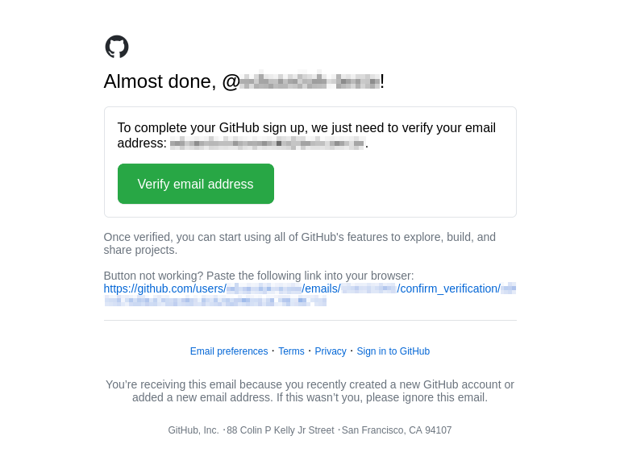
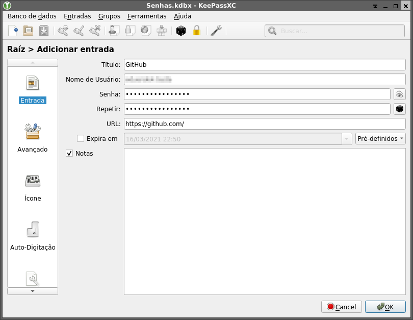
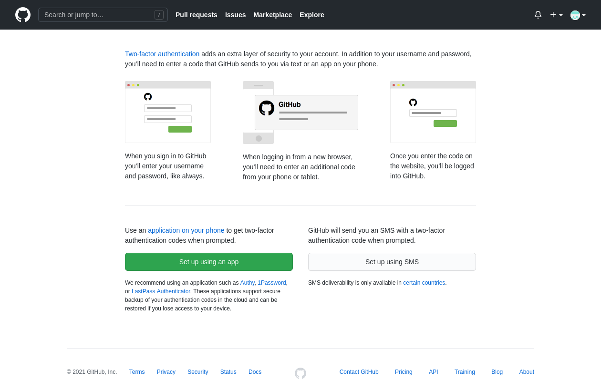
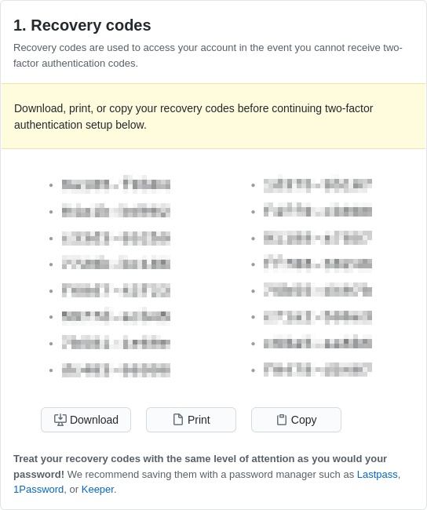
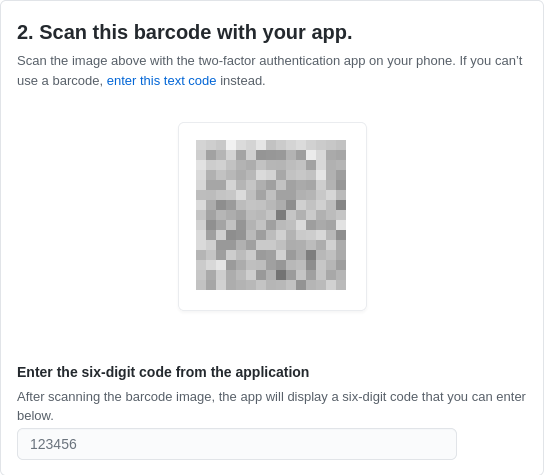
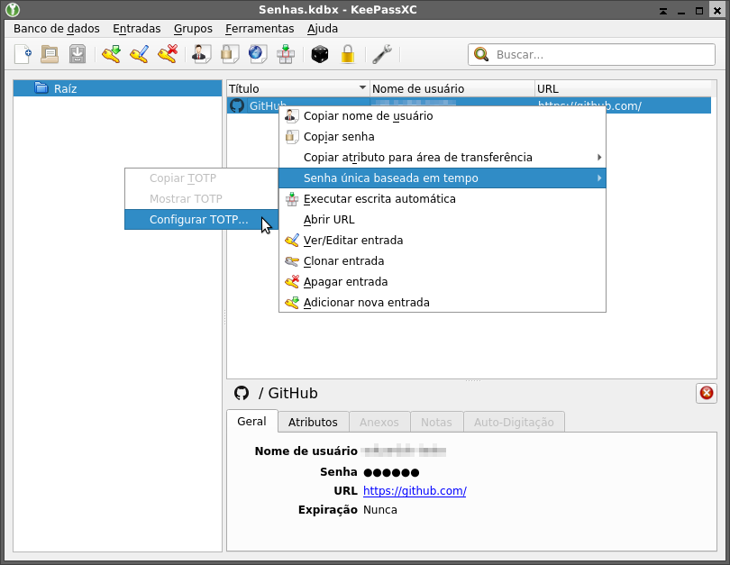
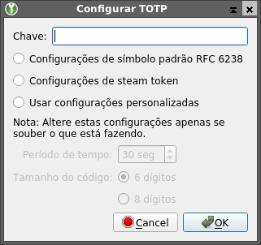
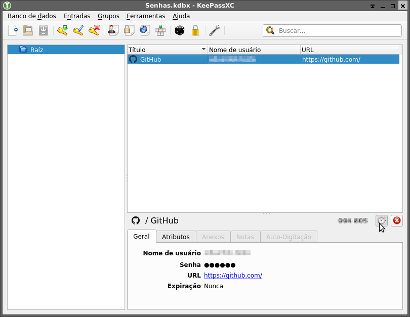
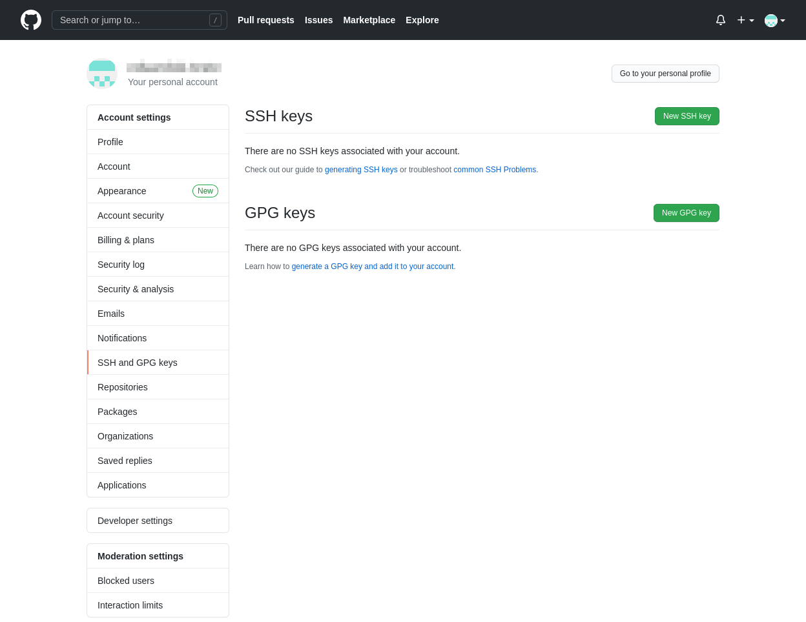
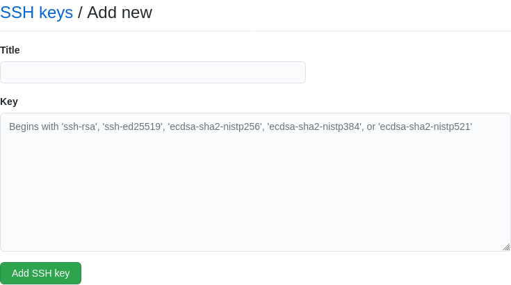

+++
title = "Configuração básica do Git e GitHub"

[taxonomies]
series = []
tags = ["Git", "GitHub"]
linguagens = []
+++

O [GitHub](https://github.com/) é um serviço bastante popular para hospedar repositórios [Git](https://git-scm.com/). Porém para conseguir utilizá-lo, e de forma segura, existem diversas configurações que podem ser feitas. Nesse texto pretendo mostrar como fazer algumas configurações como [autenticação de dois fatores (2FA)](#2fa), [chave SSH](#chave-ssh), utilizar [diferentes chaves SSH](#chave-ssh-multiplas) para diferentes contas no mesmo computador, e assinar *commits* e *tags* com [PGP](#chave-pgp).

## Conta no GitHub

Para poder utilizar o GitHub, o primeiro passo é ter uma conta. Uma conta pode ser criada preenchendo o [formulário de cadastro](https://github.com/join), que é bastante simples, requisitando um nome de usuário, e-mail e senha.


Assim que enviado o formulário, será necessário confirmar o endereço de e-mail, que é feito abrindo o link enviado para o e-mail informado no cadastro.



## Autenticação de dois fatores {#2fa}

A [autenticação de dois fatores (2FA)](https://en.wikipedia.org/wiki/Two-factor_authentication) não é obrigatória, mas bastante recomendada por questões de segurança. Ela consiste em usar, além de usuário e senha, uma senha de uso único válida apenas por um curto período de tempo. Em [alguns países](https://docs.github.com/pt/github/authenticating-to-github/countries-where-sms-authentication-is-supported#supported-countries-for-sms-authentication) é possível receber essas senhas via SMS. Quando essa opção não está disponível, ou como alternativa a ela, pode-se utilizar algum programa que gera senhas [TOTP (Time-based One-Time Password)](https://en.wikipedia.org/wiki/Time-based_One-Time_Password).

Uma opção para utilizar no computador é o [KeePassXC](https://keepassxc.org/), que possui uma versão para celular chamada [KeePassDX](https://www.keepassdx.com/). Para utilizá-lo, basta instalar o programa, criar um banco de dados (arquivo criptografado), e adicionar uma entrada para o GitHub, que pode ser usada para guardar a senha também se desejar, embora se alguém tiver acesso ao arquivo e conseguir descriptografá-lo, conseguirá ter acesso a conta, visto que teria os dois fatores necessários para autenticar.



Com o programa para gerar as senhas TOTP pronto, basta habilitar a autenticação de dois fatores na conta. Isso pode ser feito acessando a opção correspondente nas [configurações](https://github.com/settings/two_factor_authentication/intro), que apresentará as opções, que neste caso será via *app* (*"Set up using an app"*).



Primeiro serão exibidas chaves de recuperação, que funcionam como qualquer outra senha TOTP, e podem ser usadas uma única vez cada, útil quando não foi possível gerar uma senha TOTP. É recomendável guardar essas senhas em lugar seguro, e utilizá-las para recuperar o acesso a conta se houver algum problema com o dispositivo usado para gerar as senhas TOTP. Escolha uma das opções disponíveis para guardar essas chaves.



Na tela seguinte será pedido para escanear o código [QR](https://pt.wikipedia.org/wiki/C%C3%B3digo_QR) com o dispositivo, o que pode ser feito caso esteja utilizando o celular. Se estiver utilizando o computador (ou tenha problemas com a câmera), basta clicar em *"enter this text code"* e copiá-lo.



Agora basta voltar ao KeePass, clicar com o botão direito em cima da entrada feita para o GitHub, ir na opção "Senha única baseada em tempo" e "Configurar TOTP...".



Na tela de configuração basta colar o código copiado do GitHub no campo "Chave", as demais opções podem ser deixadas em branco.



Agora é necessário gerar uma senha TOTP e usá-la no GitHub para que ele saiba que o processo foi feito corretamente. Existem algumas formas para gerar uma senha TOTP: clicar com o botão direito, "Senha única baseada em tempo" e "Copiar TOTP" para copiar a senha para a área de transferência, ou "Mostrar TOTP" para exibir a senha na tela (útil quando se está fazendo o login em algum outro dispositivo), ou mesmo clicar no relógio ao final da lista de entradas, conforme a imagem a baixo para gerar e exibir a senha ao lado.



Ao inseri-la no GitHub (o caractere de espaço não é necessário), o processo será terminado e a autenticação em duas etapas estará habilitada.

## Chave SSH {#chave-ssh}

Uma das formas mais seguras para enviar *commits* para o GitHub é através de uma conexão [SSH](https://pt.wikipedia.org/wiki/Secure_Shell), o qual pode ser autenticada através de uma chave criptográfica. Para isso é necessário gerar uma chave localmente, e adicioná-la à conta do GitHub.

O programa que gera chaves criptográficas é distribuído junto com o cliente SSH, que em sistemas [Debian](https://www.debian.org/) e derivados (como [Ubuntu](https://ubuntu.com/)), pode ser instalado através do pacote [`openssh-client`](https://packages.debian.org/stable/openssh-client) que se encontra no repositório da distribuição.

> Caso você não saiba instalar pacotes, em sistemas que utilizam o APT e tiver o `sudo` configurado (padrão do Ubuntu), basta executar os seguintes comandos:
>
> ```bash
> sudo apt update
> sudo apt install openssh-client
> ```

No Windows, é possível utilizar o cliente que vem junto ao instalar o Git, bastando acessar o [site](https://git-scm.com/download/win), fazer o download, instalá-lo e utilizar o terminal do Git Bash.

As chaves utilizadas por padrão pelo cliente SSH ficam em diferentes arquivos no diretório `.ssh` que está na *home* do usuário. Por padrão, os arquivos `id_<algoritmo>` são as chaves privadas, que não devem ser compartilhadas com ninguém (o ideal é que ela nem mesmo seja copiada para outro dispositivo), e os arquivos `id_<algoritmo>.pub` são as chaves públicas, sendo apenas esse arquivo que deve ser copiado para o GitHub, podendo existir diversas chaves, cada uma utilizando diferentes algoritmos. Para verificar se já existe alguma chave é possível executar o comando `ls -1 ~/.ssh/id_*` para listar os arquivos (o exemplo a baixo mostra duas chaves).

```txt
user@pc:~$ ls -1 ~/.ssh/id_*
/home/user/.ssh/id_ed25519
/home/user/.ssh/id_ed25519.pub
/home/user/.ssh/id_rsa
/home/user/.ssh/id_rsa.pub
```

Para criar uma nova chave, basta executar o comando `ssh-keygen` informando o algoritmo desejado, a quantidade de bits (quando aplicável, conforme o algoritmo) e um nome para a chave, que normalmente é um endereço de e-mail. Para criar uma chave com o [Ed25519](https://pt.wikipedia.org/wiki/ECDSA), que é o algoritmo mais indicado atualmente, basta executar `ssh-keygen -t ed25519 -C 'user@email.com'`, será perguntado sobre o local onde a chave deve ser salva, basta apartar `Enter` para aceitar o padrão (isso sobrescreverá a chave, se já existir alguma chave nesse arquivo), e informar uma senha para criptografar a chave, repetindo ela em seguida.

```txt
user@pc:~$ ssh-keygen -t ed25519 -C 'user@email.com'
Generating public/private ed25519 key pair.
Enter file in which to save the key (/home/user/.ssh/id_ed25519):
Enter passphrase (empty for no passphrase):
Enter same passphrase again:
Your identification has been saved in /home/user/.ssh/id_ed25519.
Your public key has been saved in /home/user/.ssh/id_ed25519.pub.
The key fingerprint is:
SHA256:j5DuwjiW/FVudh0ENVEofbWxnIGYiDdhvLdXrOY4Lxc user@email.com
The key's randomart image is:
+--[ED25519 256]--+
|        oo+o*+o+.|
|       ..=.+ooo *|
|        . o....= |
|       . . o   o |
|      o S . o o  |
|     . + o o E   |
| . +  o = o * .  |
|  * oo o . + o   |
| . o...     =.   |
+----[SHA256]-----+
```

Também é possível gerar uma chave [RSA](https://pt.wikipedia.org/wiki/RSA_(sistema_criptogr%C3%A1fico)) caso o sistema não suporte Ed25519. Por padrão são gerados chaves com 2048 bits, mas atualmente recomenda-se criar chaves com 3072 ou mesmo 4096 bits, o que pode ser feito com o comando `ssh-keygen -t rsa -b 4096 -C 'seu@email.com'`, respondendo as mesmas perguntas do Ed25519.

Com a chave crida, é necessário adicionar a chave pública à conta do usuário no GitHub, o que pode ser feito nas [configurações](https://github.com/settings/keys), clicando em *"New SSH key"*.



Nessa tela basta colar o conteúdo da chave pública no campo *"Key"*, o que pode ser conseguido executando no terminal o comando `cat ~/.ssh/id_ed25519.pub`. O campo *"Title"* é opcional, e caso não seja informado, será utilizado o mesmo nome (e-mail no caso) utilizado para gerar a chave.



Para testar o acesso SSH, é possível utilizar o comando `ssh -T git@github.com`. Caso tudo tenha sido configurado corretamente, no terminal será exibido uma mensagem com o seu nome de usuário:

```txt
Hi <username>! You've successfully authenticated, but GitHub does not provide shell access.
```

> No primeiro acesso a algum servidor através de SSH, é possível que alguma mensagem como a abaixo seja exibida:
>
> ```txt
> The authenticity of host 'github.com (140.82.113.4)' can't be established.
> RSA key fingerprint is SHA256:nThbg6kXUpJWGl7E1IGOCspRomTxdCARLviKw6E5SY8.
> Are you sure you want to continue connecting (yes/no)?
> ```
>
> Nesse caso basta confirmar com `yes` para que o seu cliente SSH adicione esse servidor a lista de servidores conhecidos, e continue com o processo de conexão.

Caso algum problema ocorra e a conexão não tenha sido feita, é possível utilizar o modo verboso do SSH para verificar o processo e tentar identificar o problema, exemplo: `ssh -vT git@github.com`.

### Não precisar repetir a senha

Caso a chave SSH tenha sido criada com alguma senha, toda vez que ela for utilizada para se conectar no servidor será necessário informar essa senha. Uma forma de evitar isso é usando o `ssh-agent` para armazenar em memória essa senha, e enquanto o processo do `ssh-agent` estiver rodando, o cliente SSH utilizará essa chave sem pedir a senha novamente.

Para adicionar uma chave ao `ssh-agent` basta executar o comando `ssh-add <caminho-da-chave>` informando o arquivo que contem a chave privada, caso a chave esteja no caminho padrão, basta executar `ssh-add` para carregar todas as chaves padrões.

> Caso o comando `ssh-add` apresente alguma mensagem de que não foi possível conectar ao `ssh-agent`, o mesmo pode ser iniciado com o comando `eval "$(ssh-agent -s)"`. Porém recomendo verificar como ativar esse serviço por padrão, de forma que todos os terminais consigam utilizar o mesmo agente, essa configuração varia de ambiente para ambiente.

Outra forma de adicionar a chave ao `ssh-agent` é configurando o cliente SSH para fazer isso automaticamente, o que pode ser feito adicionando o parâmetro `AddKeysToAgent yes` na sua configuração que fica em `~/.ssh/config`. A baixo seguem um exemplo utilizando esse parâmetro, assim como outros parâmetros específicos para o GitHub (usuário `git` por padrão e autenticação apenas pela chave Ed25519).

```config
Host github.com
  User git
  IdentitiesOnly yes
  IdentityFile ~/.ssh/id_ed25519

Host *
  AddKeysToAgent yes
```

Para mais detalhes sobre esse arquivo de configuração consulte sua [manpage](https://manpages.debian.org/stable/ssh_config) (`man ssh_config`).

### Múltiplas chaves {#chave-ssh-multiplas}

Eventualmente pode existir a necessidade de utilizar duas ou mais contas do GitHub no mesmo computador, como uma conta pessoal e outra do trabalho. Para que o acesso SSH seja possível, é necessário criar uma chave diferente para cada conta, o que se resume a executar o comando já informado, apenas informar um caminho ou nome de arquivo diferente.

Porém para o cliente SSH utilizar uma chave diferente é necessário informar essa nova chave, como `ssh -i ~/.ssh/id_ed25519_empresa -T git@github.com`. Para facilitar o acesso, é possível criar um apelido para o GitHub, e dizer que todo o acesso feito através desse apelido usará outra chave, como com a configuração a baixo do arquivo `~/.ssh/config`:

```config
Host github.com
  User git
  IdentitiesOnly yes
  IdentityFile ~/.ssh/id_ed25519

Host empresa.github.com
  HostName github.com
  User git
  IdentitiesOnly yes
  IdentityFile ~/.ssh/id_ed25519_empresa

Host *
  AddKeysToAgent yes
```

Assim todo acesso feito para `github.com` usará a chave padrão, enquanto `empresa.github.com` usará outra chave, se cada chave estiver cadastrada para diferentes usuários, seus nomes devem aparecer ao executar `ssh -T git@github.com` e `ssh -T git@empresa.github.com`.

Ainda é possível configurar o Git para passar a chave como parâmetro para o cliente SSH com o comando `git config core.sshCommand 'ssh -i ~/.ssh/id_ed25519_empresa'`, porém seria necessário fazer isso individualmente para cada repositório, além de dificultar o processo de clone do repositório, visto que seria necessário criar um repositório vazio, fazer essa configuração para aquele repositório, e só então fazer o clone manualmente (adicionando a URL remota e fazendo o `fetch`).

## Chave PGP {#chave-pgp}

O Git permite assinar digitalmente *commits* e *tags*, o que permitiria a qualquer pessoa verificar se realmente quem as fez foi seu autor, e que não houve nenhuma modificação por terceiros. Para isso é possível utilizar chaves [PGP](https://pt.wikipedia.org/wiki/Pretty_Good_Privacy), que as vezes são chamadas de chaves GPG devido ao nome do programa utilizado para isso ([GNU Privacy Guard](https://www.gnupg.org/)).

Em sistemas Debian e derivados, basta instalar o pacote [`gnupg`](https://packages.debian.org/stable/gnupg), enquanto no Windows ele é instalado junto com o Git, e está disponível no terminal Git Bash.

Para verificar as chaves PGP existentes, pode-se utilizar o comando `gpg --list-secret-keys --keyid-format LONG`, que listará todas as chaves privadas existentes.

```txt
user@pc:/$ gpg --list-secret-keys --keyid-format LONG
/home/user/.gnupg/pubring.kbx
------------------------
sec   rsa4096/F1EFDB0A94CDCE4F 2021-03-17 [SC]
      08955621A4971CD813051D4CF1EFDB0A94CDCE4F
uid                 [ultimate] Seu Nome <user@email.com>
ssb   rsa4096/40629AC8A26C0D62 2021-03-17 [E]
```

Onde o código de identificação da chave (`id_chave`) é exibido na linha `sec`, logo após o algoritmo utilizado pela chave, que nesse caso é `F1EFDB0A94CDCE4F`.

Para se gerar uma nova chave PGP, pode-se utilizar o comando `gpg --full-generate-key` e responder as perguntas feitas.

```txt
user@pc:~$ gpg --full-generate-key
gpg (GnuPG) 2.2.12; Copyright (C) 2018 Free Software Foundation, Inc.
This is free software: you are free to change and redistribute it.
There is NO WARRANTY, to the extent permitted by law.

Please select what kind of key you want:
   (1) RSA and RSA (default)
   (2) DSA and Elgamal
   (3) DSA (sign only)
   (4) RSA (sign only)
Your selection? 1
RSA keys may be between 1024 and 4096 bits long.
What keysize do you want? (3072) 4096
Requested keysize is 4096 bits
Please specify how long the key should be valid.
         0 = key does not expire
      <n>  = key expires in n days
      <n>w = key expires in n weeks
      <n>m = key expires in n months
      <n>y = key expires in n years
Key is valid for? (0) 0
Key does not expire at all
Is this correct? (y/N) y

GnuPG needs to construct a user ID to identify your key.

Real name: Seu Nome
Email address: user@email.com
Comment:
You selected this USER-ID:
    "Seu Nome <user@email.com>"

Change (N)ame, (C)omment, (E)mail or (O)kay/(Q)uit? o
We need to generate a lot of random bytes. It is a good idea to perform
some other action (type on the keyboard, move the mouse, utilize the
disks) during the prime generation; this gives the random number
generator a better chance to gain enough entropy.
We need to generate a lot of random bytes. It is a good idea to perform
some other action (type on the keyboard, move the mouse, utilize the
disks) during the prime generation; this gives the random number
generator a better chance to gain enough entropy.
gpg: key F1EFDB0A94CDCE4F marked as ultimately trusted
gpg: revocation certificate stored as '/home/user/.gnupg/openpgp-revocs.d/08955621A4971CD813051D4CF1EFDB0A94CDCE4F.rev'
public and secret key created and signed.

pub   rsa4096 2021-03-17 [SC]
      08955621A4971CD813051D4CF1EFDB0A94CDCE4F
uid                      Seu Nome <user@email.com>
sub   rsa4096 2021-03-17 [E]
```

Para testar a chave PGP, basta criar um arquivo qualquer, e executar o comando `gpg -sbu <id_chave> <arquivo>`, e para verificar a assinatura executar o comando `gpg --verify <arquivo>.sig`.

```txt
user@pc:~$ gpg -sbu F1EFDB0A94CDCE4F arquivo.txt
user@pc:~$ gpg --verify arquivo.txt.sig
gpg: assuming signed data in 'arquivo.txt'
gpg: Signature made dom 21 mar 2021 21:19:07 -03
gpg:                using RSA key 08955621A4971CD813051D4CF1EFDB0A94CDCE4F
gpg: Good signature from "Seu Nome <user@email.com>" [ultimate]
```

A configuração de qual chave o Git deverá utilizar será discutido na seção seguinte. Porém para utilizar a chave para assinar um *commit* basta acrescentar o parâmetro `-S` no comando `git commit`, e para assinar uma *tag* basta acrescentar o parâmetro `-s` no comando `git tag`.

Para adicionar a chave PGP no GitHub, basta acessar a opção nas [configurações](https://github.com/settings/keys), clicando em *"New GPG key"*.


Nessa tela basta colar o conteúdo da chave pública no campo *"Key"*, o que pode ser conseguido executando no terminal o comando `gpg --armor --export <id_chave>` (exemplo `gpg --armor --export F1EFDB0A94CDCE4F`).


## Configuração do Git

Para utilizar o Git em sistemas Debian e derivados, é necessário instalar o pacote [`git`](https://packages.debian.org/stable/git). No Windows, a instalação pode ser feita como já apresentado anteriormente.

Em relação a configuração do Git, ela pode ser feita com `git config` e aplicada em 3 níveis: Sistema, que é aplicável a qualquer repositório de qualquer usuário. Global, que é aplicável a qualquer repositório de um usuário específico. E local, que se aplica apenas ao repositório onde a configuração foi feita. A configuração do sistema fica em `/etc/gitconfig` e pode ser acessada com o parâmetro `--system`, mas normalmente não é utilizada. A configuração global fica em `~/.gitconfig` ou `~/.config/git/config` e pode ser acessada com o parâmetro `--global`. E a configuração local fica em `.git/config` dentro de cada repositório, podendo ser acessada com o parâmetro `--local` ou não informando outro nível (nível padrão).

Duas configurações obrigatórias para usar o Git são `user.name`, que é o nome do usuário, e `user.email`, que é o endereço de e-mail, ambos utilizados como autor ao se fazer um *commit*. Para evitar o trabalho de reconfigurá-los toda hora, essa configuração normalmente é feita em nível global, como no exemplo a baixo:

```bash
git config --global user.name "Seu Nome"
git config --global user.email "user@email.com"
```

Porém caso deseja-se utilizar um nome ou e-mail diferente em determinado repositório, esses comandos podem ser usados dentro do repositório sem o parâmetro `--global`, como no caso de usar o e-mail da empresa em vez do e-mail pessoal.

Ainda existem outros parâmetros, como `user.signingkey` que informa qual chave PGP deve ser utilizada, `core.editor` que informa o editor a ser utilizado para editar mensagens de *commit*, por exemplo (substituindo o [vim](https://www.vim.org/) caso queira utilizar outro editor). Mais informações podem ser vistas na sua [manpage](https://manpages.debian.org/stable/git-config) (`man git-config`), assim como uma descrição do formato do arquivo de configuração, que pode ser editador, ou simplesmente visualizado para verificar as configurações aplicadas, como o exemplo a baixo:

```ini
[user]
    name = Seu Nome
    email = user@email.com
    signingkey = F1EFDB0A94CDCE4F
[core]
    editor = vim
```

### Branch padrão

Seguindo a nomenclatura do [Bitkeeper](https://www.bitkeeper.org/), a *branch* padrão do Git é a `master`, porém aos poucos está sendo alterado para `main`. No GitHub essa mudança já [foi feita](https://github.com/github/renaming) e qualquer novo repositório criado pela interface com um arquivo de licença ou *readme* terá a branch `main`, embora esse nome possa ser alterado nas [configurações](https://github.com/settings/repositories). O [GitLab](https://gitlab.com/) também segue pelo [mesmo caminho](https://about.gitlab.com/blog/2021/03/10/new-git-default-branch-name/). Porém no Git essa mudança ainda não se tornou o padrão, mas a partir da versão 2.28.0, foi acrescentado um parâmetro para definir o nome padrão da *branch* ao se criar um repositório (`init.defaultBranch`). Então caso deseja que ao executar um `git init` seja criado a branch `main` em vez da `master`, basta alterar as configurações com `git config --global init.defaultBranch main`.

### Linha de comando

Uma configuração bastante útil do Git é mostrar a *branch* atual o estado do repositório na linha de comando. No Git Bash isso já vem ativo por padrão, porém em outros ambientes é necessário ativar. O *script* responsável por isso é o [`git-prompt`](https://github.com/git/git/blob/master/contrib/completion/git-prompt.sh), e no Debian e derivados já é instalado junto com o Git, porém dependendo do pacote `bash-completion` para ser carregado e que seja habilitado na variável de ambiente `PS1`. A baixo segue um exemplo de configuração que pode ser adicionado ao arquivo `~/.bashrc` para habilitá-lo, junto com alguns de seus parâmetros de configuração:

```.bashrc
PS1="${PS1//\\\$/\$(__git_ps1)\\\$}"
GIT_PS1_SHOWDIRTYSTATE=true
GIT_PS1_SHOWSTASHSTATE=true
GIT_PS1_SHOWUNTRACKEDFILES=true
GIT_PS1_SHOWUPSTREAM=auto
GIT_PS1_SHOWCOLORHINTS=true
```

## Considerações

Embora esse texto se focou no GitHub, ele também pode ser aplicado para outros sistemas, como o GitLab. Algumas partes, como a configuração do SSH pode ser reaproveitada para acesso a servidores, e o KeePass para a autenticação em duas etapas de outros sites.

Por questões de segurança, todas as chaves geradas durante a criação desse texto foram apagadas, assim como a conta criada no GitHub.
