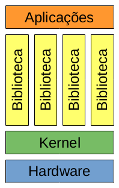
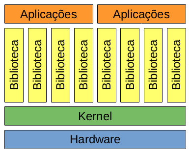

+++
title = "Isolamento de aplicações: Sistema de arquivos"

[taxonomies]
series = ["Isolamento de aplicações"]
tags = ["Sistema Operacional", "Sistema de Arquivos"]
linguagens = []
+++

Aplicações são desenvolvidas e muitas vezes executadas como serviços em servidores, os quais podem rodar uma única aplicação, ou compartilhar seus recursos de *hardware* entre diversas aplicações. Entretanto podem existir conflitos entre as aplicações, como requisitarem a mesma porta de rede, exigirem versões diferentes de biblioteca e afins, além de questões de segurança. Nesse primeiro texto será abordado como isolar o sistema de arquivos entre os processos dessas aplicações, de forma que um processo não consiga visualizar os arquivos referentes a outra aplicação.

## Arquitetura do sistema

Antes de entrar em detalhes de como fazer esse isolamento, vamos entender a arquitetura do sistema onde os processos são executados. Dividindo a arquitetura em camadas, indo da mais baixa para a mais alta, temos:

**Hardware:** Que é o computador ou servidor onde o processo da aplicação será executado. Normalmente inclui processador, memória RAM, espaço de armazenamento (HD ou SSD), placa de rede e demais dispositivos.

**Kernel:** Parte do sistema operacional, responsável por gerenciar tanto o *hardware* quanto os processos das aplicações que serão executados. Essa série se focará no *kernel* Linux.

**Bibliotecas:** São diversos arquivos com rotinas comuns entre os processos, assim como também disponibilizam funções para interagir com o *kernel* do sistema. Nesse ambiente são comumente arquivos binários `.so`, semelhante aos `.dll` do Windows, e normalmente se encontram em diretórios como `/usr/lib` e `/usr/lib/x86_64-linux-gnu`. Porém podem estar em outros diretórios como `/usr/lib/php` que são bibliotecas específicas do PHP, ou `/usr/lib/python3/dist-packages` que são os módulos do Python 3, que nesse caso também não precisam ser arquivos binários.

**Aplicações:** São os diversos processos das aplicações que estão em execução no servidor, podendo utilizar as bibliotecas disponíveis no sistema.

Um desenho das camadas dessa arquitetura pode ser vista a seguir:



## Problema de um sistema de arquivos compartilhado

Porém, como já foi mencionado, podem ocorrer problemas nesse sistema, como uma aplicação precisar de uma biblioteca em uma versão, enquanto outra aplicação precisar de uma versão diferente da mesma biblioteca, e se essas versões forem incompatíveis entre si, não seria possível rodar as duas aplicações. Algumas linguagens apresentam soluções para esse problema criando outros diretórios onde as bibliotecas são procuradas, como o Python com o [ambiente virtual](https://docs.python.org/pt-br/3/library/venv.html), ou informando o sistema para procurar as bibliotecas `.so` em outro diretório com a variável de ambiente `LD_LIBRARY_PATH`. Entretanto, cada caso de linguagem vai exigir uma solução diferente, e pode ocorrer o caso de alguma não possuir uma solução para isso.

Outro problema é que uma aplicação poderia acessar os arquivos da outra, tanto lendo dados que não poderia, quanto alterando-os. Isso é preocupante do ponto de vista de segurança, onde uma aplicação poderia ser invadida, e através dela, acessar os dados de outra, ou causar a falha de uma aplicação, inserindo algum código malicioso para outra aplicação executar, ou simplesmente apagando seus dados.

## Enjaulando uma aplicação

Uma opção para resolver esses problemas é o enjaulamento (isolamento) de uma aplicação, restringindo o acesso dos processos a apenas uma parte do sistema de arquivos, como se um diretório específico fosse a raiz do sistema para os processos de uma aplicação. Isso exigiria criar toda a estrutura de diretório do sistema operacional, assim como ter uma cópia de bibliotecas e demais arquivos dentro desse diretório. Desta forma teria um único *kernel* em execução, porém para alguns processos a raiz do sistema de arquivos (`/`) seria a raiz de fato, e para outros processos veriam um diretório (como `/media/sistema`) como a raiz do sistema de arquivos. Isso duplicaria as camadas de bibliotecas e aplicação do sistema:



Isso também permite acessar e rodar programas instalados em outras distribuições GNU/Linux que possam existir no computador, visto que as bibliotecas e aplicações conseguem executar em diferentes versões do *kernel*, porém se tentasse executar diretamente, poderia falhar devido a falta de alguma dependência. Inclusive algumas distros, como o [Funtoo](https://www.funtoo.org/), disponibilizam formas de usar o *kernel* compilado de outras distribuições, como no caso [o *kernel* compilado pelo Debian](https://www.funtoo.org/Funtoo_Linux_Kernels/pt-br). Além de também ser possível utilizar o [Linux-libre](https://pt.wikipedia.org/wiki/GNU_Linux-libre) no lugar do *kernel* Linux da distro.

Essa solução também está presente dentro de algumas aplicações, como o [Bind9](https://www.isc.org/bind/) que é um servidor [DNS](https://pt.wikipedia.org/wiki/Sistema_de_Nomes_de_Dom%C3%ADnio), e utiliza essa técnica para mitigar problemas de segurança. Uma forma de utilizá-la pode ser vista na [Wiki do Debian](https://wiki.debian.org/Bind9#Bind_Chroot). E por estar dentro da aplicação, também exige menos coisas dentro dessa "jaula", ocupando menos espaço.

### Criação de uma jaula

Para criar uma jaula contendo toda a estrutura de uma distribuição, é possível utilizar seu próprio processo de instalação. Nesse caso será utilizado o processo de [instalação do Debian a partir de outra distribuição](https://www.debian.org/releases/stable/amd64/apds03.pt.html), que consiste em instalar o utilitário `debootstrap` (pacote `debootstrap` no Debian e derivados, ou seguindo os passos presentes no guia de instalação para extrair o script do pacote `.deb`), e utilizá-lo para criar toda a estrutura do Debian dentro de um diretório. Com o `debootstrap` instalado, basta executá-lo informando a versão desejada, diretório onde o a estrutura deve ser criada, e opcionalmente o endereço do repositório que deve ser utilizado. Exemplo:

```sh
debootstrap buster /media/sistema http://ftp.br.debian.org/debian
```

Assim que o comando finalizar, já será possível acessar a estrutura presente em `/media/sistema`, porém esse caminho precisaria ser sempre utilizado como prefixo para acessar qualquer arquivo. Para fazer com que isso ocorra de forma transparante, "enjaulando" uma aplicação nesse diretório, o comando `chroot` pode ser utilizado. Exemplo:

```sh
chroot /media/sistema
```

A partir desse ponto, tudo que executar através desse terminal, ao tentar criar um arquivo como `/arquivo.txt`, para o que estiver dentro da jaula parecerá que está acessando um arquivo na raiz do sistema de arquivos, porém para outros processos (fora da jaula) esse arquivo estará na verdade em `/media/sistema/arquivo.txt`. E qualquer aplicação poderá ser instalada com o `apt` dentro dessa jaula, mesmo se a distribuição utilizada não for um Debian ou derivados, visto que para os processos dentro dessa jaula enxergariam o sistema Debian.

## Considerações

O isolamento do sistema de arquivos (jaula) é bastante interessante para limitar os arquivos que um processo pode acessar, assim como para executar programas que estão instalados em outras distribuições presentes no computador. Porém ela exige a instalação quase que completa de uma distribuição, só não precisando coisas relacionadas ao *kernel*, uma vez que é utilizado o *kernel* que já está em execução no computador, utilizando apenas um espaço de nomes (*namespace*) diferente para o sistema de arquivos.

Entretanto esse isolamento ainda não é completo, uma vez que existem outras coisas compartilhas entre os processos de dentro da jaula com os de fora da jaula, como tabela de processos e pilha de rede.
