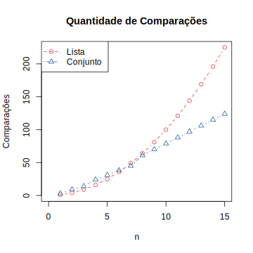

+++
title = "Discussão sobre o Advent of Code 2022 - Dia 3: Complexidade de operações em estruturas de dados"

[taxonomies]
series = ["Advent of Code"]
tags = ["Desempenho", "Otimização"]
linguagens = ["Python"]
+++

Terceiro dia do [Advent of Code deste ano](https://adventofcode.com/2022), o problema desse dia é bastante interessante para discutir sobre a complexidade de operações em estruturas de dados.

## O problema do dia 3

O problema do dia 3 ["reorganização da mochila"](https://adventofcode.com/2022/day/3) consiste em encontrar elementos repetidos em diferentes coleções de valores. Novamente, recomendo que tentem resolvê-lo primeiro, e o vídeo do [Bruno Rocha](https://twitter.com/rochacbruno):

{{ youtube(id="QROejIb9Zqc") }}

{{ youtube(id="qd_MOTS2gOo") }}

## Questão - Estrutura de dados e complexidade de operações

Uma forma bastante simples de representar os compartimentos das mochilas na primeira parte, ou as mochilas na segunda parte, é com uma lista ou array, onde cada posição é um item. E isso é bastante direto e prático, já que muitas linguagens permitem acessar o caractere de uma posição da string, fazendo a string já se comportar como uma lista de certa forma.

Para encontrar os itens em comum em duas strings bastaria comparar todos seus elementos. Exemplo:

```python
itens_em_comum = []
for a in compartimento1:
    for b in compartimento2:
        if a == b:
            itens_em_comum.append(a)
```

Isso ainda pode ser simplificado para o código a baixo:

```python
for a in compartimento1:
    if a in compartimento2:
        itens_em_comum.append(a)
```

Apensar da mudança, o código vai executar exatamente os mesmos passos, que são comparar cada item do `compartimento1` com cada item do `compartimento2`. Isso faz com que sejam necessárias `n * m` comparações, sendo `n` a quantidade de itens no `compartimento1` e `m` a quantidade de itens no `compartimento2`, que como na parte 1 os dois compartimentos têm a mesma quantidade de itens (`n = m`), é possível afirmar que são `n²` comparações (`O(n²)`).

Porém listas não são a única estrutura de dados que poderiam representar os compartimentos. Como nesse problema itens repetidos no mesmo compartimento e sua ordem não são importantes, é possível utilizar conjuntos (conhecidos como *set* em algumas linguagens de programação) e que podem ser implementados com uma [árvore de busca binária](https://pt.wikipedia.org/wiki/%C3%81rvore_bin%C3%A1ria_de_busca) ou [tabela de espalhamento](https://pt.wikipedia.org/wiki/Tabela_de_dispers%C3%A3o). Exemplo:

```python
compartimento2 = set(compartimento2)
for a in compartimento1:
    if a in compartimento2:
        itens_em_comum.append(a)
```

Uma vantagem de se utilizar um conjunto é que itens repetidos são removidos, ou seja, uma mesma comparação não é feita com outra cópia do mesmo item. Outra vantagem é que a operação para verificar se um item existe em outro conjunto, quando implementado em uma árvore de busca binária, reduz o espaço de busca pela metade a cada comparação, sendo assim aproximadamente `n * log2(n)` comparações para se encontrar todos os itens repetidos, que é menor que `n²`.

Entretanto, enquanto numa lista, para adicionar um item basta copiá-lo no final da mesma (`O(1)`), para adicionar um item em uma árvore de busca binária é necessário encontrar a posição para aquele item na árvore (`O(log2(n))`), e isso se repete para cada item, além de as vezes ser necessário rebalancear a árvore. Resumidamente existe algum processamento para se construir a árvore, e isso deve ser levado em consideração. Porém como a construção da árvore tem a mesma complexidade da busca que ocorre depois (`O(n * log2(n))`), faz compensar para uma grande quantidade de itens, mas pode não compensar para uma baixa quantidade, veja a baixo um gráfico comparando a quantidade de comparações para ambos os casos.



## Considerações

Uma mesma operação pode ter complexidades diferentes para diferentes estruturas de dados, como no caso a função para verificar se um item existe em outra coleção (`O(n²)` na lista, e `O(n * log2(n))` no conjunto). Porém além da operação, pode ser necessário considerar a construção da estrutura de dados, que neste caso compensa para muitos itens, mas pode não compensar para quantidades pequenas.

Ainda existem outras opções para resolver esse problema, como converter os dois compartimentos para conjuntos e utilizar funções que busquem a [interseção](https://pt.wikipedia.org/wiki/Interse%C3%A7%C3%A3o) dos mesmos (o que foi feito pelo Bruno Rocha nos seus vídeos). Porém isso obriga a construção de mais um conjunto, e se o algoritmo não tirar vantagem dessa estrutura de dados, como percorrer os itens de uma coleção buscando se existe na outra, que é o que ocorre usando uma lista para um compartimento e um conjunto para outro, isso pode não mudar a complexidade ciclomática do algoritmo e deixa o código mais lento.

Também pode ser analisado a complexidade ao utilizar uma [tabela de espalhamento](https://pt.wikipedia.org/wiki/Tabela_de_dispers%C3%A3o) para implementar os conjuntos (o Python faz isso), que traria outra complexidade para essas operações, podendo ter ou não um melhor desempenho, como já discutido no [dia 2](@/2022-12-02-advent-of-code-2022-dia-02/index.md).

Ou ainda trabalhando com as listas, poderia ser ordenados os itens, o que permitiria fazer uma [busca binária](https://pt.wikipedia.org/wiki/Pesquisa_bin%C3%A1ria) na lista (recomendo esse [vídeo sobre o assunto](https://www.youtube.com/watch?v=JNXE4lbwIZs)), isso não removeria os itens duplicados no processamento, porém visto a complexidade `O(n * log2(n))` dos algoritmos de ordenação e `O(log2(n))` da busca binária, teria uma eficiência do algoritmo similar as outras opções analisadas (`O(n * log2(n))`).
