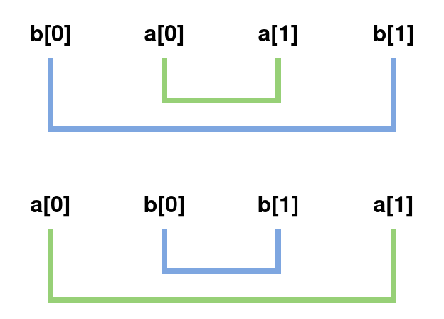
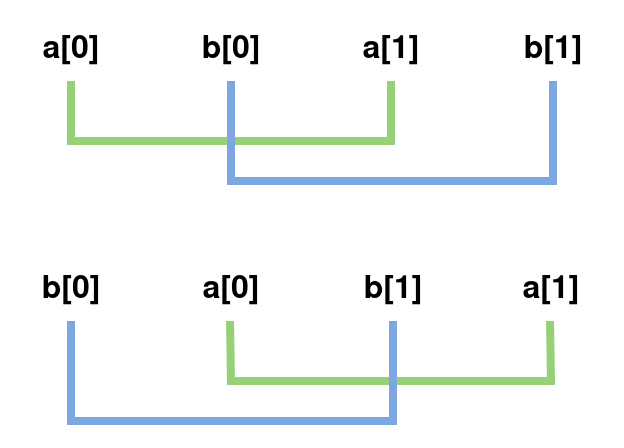
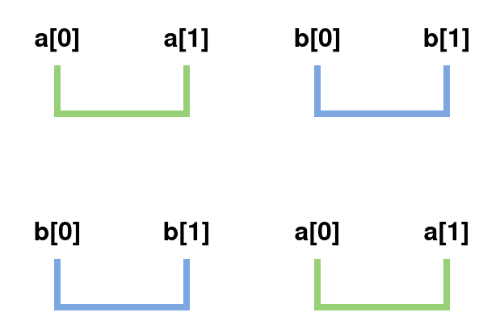

+++
title = "Discussão sobre o Advent of Code 2022 - Dia 4: Algebra booliana e ordenação"

[taxonomies]
series = ["Advent of Code"]
tags = ["Matemática"]
linguagens = ["Rust"]
+++

Quarto dia do [Advent of Code deste ano](https://adventofcode.com/2022), o problema desse dia é bastante interessante para discutir sobre álgebra booliana e ordenação completa ou parcial, e como ela é implementado em linguagens como [Rust](https://www.rust-lang.org/pt-BR/).

## O problema do dia 4

O problema do dia 4 ["limpeza do acampamento"](https://adventofcode.com/2022/day/4) consiste em ler uma sequência de intervalos e encontrar se eles se sobrepõem. Novamente, recomendo que tentem resolvê-lo primeiro, mas se tiver dificuldades pode seguir com a leitura desse texto.

## 1ª Questão - Álgebra booliana

A parte 1 do problema pede para encontrar sobreposições completas, algo como um dos dois casos da imagem a baixo, que mostra as bordas dos dois conjuntos em ordem numérica:

Visualizando a imagem é fácil chegar a conclusão de que a condição para uma sobreposição completa é `(b[0] <= a[0] <= a[1] <= b[1]) || (a[0] <= b[0] <= b[1] <= a[1])` já que é a ordem em que elas aparecem na imagem.

A parte 2 do problema pode para encontrar sobreposições parciais também, novamente uma imagem pode ajudar:

Na imagem vemos as ordens `(a[0] <= b[0] <= a[1] <= b[1]) || (b[0] <= a[0] <= b[1] <= a[1])`. Pegando apenas o primeiro caso para analisar, nessa parte do problema condições como `a[0] <= b[0] <= a[1] <= b[1]` (sobreposição parcial) e `a[0] <= b[0] <= b[1] <= a[1]` (sobreposição completa) são as procuradas. Analisando um pouco, pode-se observar que `b[1]` não importa tanto para essa condição, já que ele pode estar tanto antes quanto depois de `a[1]`, sendo assim, pode-se removê-lo da condição: `a[0] <= b[0] <= a[1]`. E isso se repete para o segundo caso, chegando na condição final `(a[0] <= b[0] <= a[1]) || (b[0] <= a[0] <= b[1])`.

Porém essa é apenas uma das formas a se chegar a condição. Outra forma que pode ser interessante para a parte 2 é pensar o oposto, o que seria uma não sobreposição:

Esse caso é muito mais simples, bastando observar que se `a[1] < b[0] || b[1] <= a[0]` não existe nenhum tipo de sobreposição, e para encontrar uma sobreposição basta inverter essa condição, negando-a: `!(a[1] < b[0] || b[1] < a[0])`.

Ainda existe a possibilidade de trabalhar com essa condição utilizando [álgebra booliana](https://pt.wikipedia.org/wiki/Álgebra_booliana) para remover a negação, (eu já comentei sobre isso nesse [texto](@/2021-05-15-algebra-booliana/index.md), recomendo a leitura), e isso permite chegar na condição `a[1] >= b[0] && b[1] >= a[0]`, que é mais simples do que `(a[0] <= b[0] <= a[1]) || (b[0] <= a[0] <= b[1])` que havia sido encontrado anteriormente.

## 2ª Questão - Ordenação

Em toda essa discussão assumi que `a[0] <= a[1]` e `b[0] <= b[1]`, e que o problema nos garante isso (pelo menos não existe caso onde isso não seja válido na entrada dada). Isso permite que não seja necessário verificar se o intervalo está invertido, e assumir que se `a < b` e `b < c` então `a < c`, uma vez que está lidando com números inteiros que também tem essa propriedade.

Voltando ao problema do ["pedra papel tesoura" do dia 2](@/2022-12-02-advent-of-code-2022-dia-02/index.md), também poderia se utilizar das operações de maior e menor para dizer quem ganha ou perde de quem, exemplo: `pedra < papel` e `papel < tesoura`, porém observe que isso não nos permite assumir que `pedra < tesoura`, visto que o correto seria `tesoura < padra`. Quando isso ocorre, temos um [conjunto parcialmente ordenado](https://pt.wikipedia.org/wiki/Conjunto_parcialmente_ordenado).

Embora isso não faça diferença para a resolução do problema do Advent of Code, permite entender a diferença entre as traits [`Ord`](https://doc.rust-lang.org/std/cmp/trait.Ord.html) e [`PartialOrd`](https://doc.rust-lang.org/std/cmp/trait.PartialOrd.html) do Rust, onde se quiser comparar valores com `>` e `<`, deve-se implementar a `PartialOrd`, e se for seguro assumir que se `a < b` e `b < c` então `a < c` pode-se implementar também a `Ord`, e essa é a diferença entre elas. Isso também ocorre de forma análoga para as comparações com as traits [`Eq`](https://doc.rust-lang.org/std/cmp/trait.Eq.html) e [`PartialEq`](https://doc.rust-lang.org/std/cmp/trait.PartialEq.html) (se `a == b` e `b == c` então `a == c`, pode-se implementar também a `Eq`). Apesar de não fazer parte do problema, fica como curiosidade e conhecimento.

## Considerações

Se estiver difícil de escrever ou entender alguma condição, às vezes vale a pena pensar o oposto e negá-la, sendo opcional o trabalho com a álgebra booliana para tentar reduzir a quantidade de operações.

Quando estiver trabalhando com comparações (maior, menor, igualdade, diferença) vale a pena observar se ela é uma comparação apenas parcial, ou se pode-se assumir outras condições a partir do que já foi verificado. Algoritmos de ordenação, por exemplo, tiram bastante proveito disso para reduzir seus tempos de execução. Quando aplicado, pode ser algo trabalhado no algoritmo para buscar melhorar sua performance.
