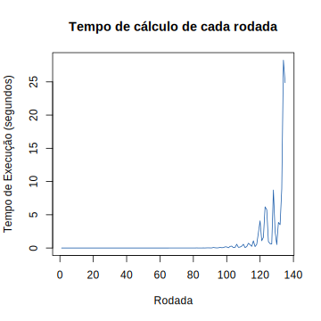

+++
title = "Discussão sobre o Advent of Code 2022 - Dia 11: Complexidade de operações com números grandes"

[taxonomies]
series = ["Advent of Code"]
tags = ["Desempenho", "Otimização"]
linguagens = []
+++

No décimo primeiro dia do [Advent of Code de 2022](https://adventofcode.com/2022) tem um problema interessante para discutir sobre a complexidade de operações com números grandes.

## O problema do dia 11

O problema do dia 11, ["macaco no meio"](https://adventofcode.com/2022/day/11), consiste em seguir uma sequência de passos, que pode ser implementada em código, para simular o ocorrido e calcular a resposta. Recomendo tentar resolvê-lo primeiro.

## Resolução da parte 1

Não existe nenhuma pegadinha na parte 1 do problema. Talvez a parte mais difícil possa ser ler a entrada, porém como o programa não precisa ser dinâmico, os dados dessa entrada podem estar fixos dentro do código, não sendo necessário ler o arquivo da entrada, simplificando o código. No demais é escrever um código que itere sobre os valores e tome as ações conforme descrito no problema.

## Resolução da parte 2

A parte 2 é igual à parte 1, mas com duas diferenças: o valor de preocupação com o item não é divido por 3 e devem ser calculado mais rodadas (passando de 20 para 10.000). Esses ajustes são simples de fazer no código, porém na hora de executar o programa ele fica calculando e não termina. O gráfico a baixo mostra o tempo que a solução que implementei leva para calcular cada rodada até a 135 no meu computador:



No gráfico pode ser visto que as primeiras rodadas tiveram um tempo relativamente baixo, porém com o passar do tempo, aparecem picos cada vez mais altos, e os vales também estão subindo, ou seja, o tempo para se calcular uma nova rodada está crescendo conforme as rodadas foram passando. A pergunta que fica é porque isso ocorre se as operações são as mesmas e a quantidade de itens também não varia? O que está deixando o código mais lento?

### Bibliotecas para números grandes

Como eu fiz o meu programa em Python esse foi o comportamento do meu código, porém em outras linguagens poderia dar erro, ou até rodar relativamente rápido, mas apresentar resultados incorretos. Isso ocorre porque, como um valor manipulado pelo programa cresce, ele deixa de caber no espaço de uma variável de alguns bits (normalmente 16, 32, ou até 64 bits), ocorrendo um [*overflow* de inteiro](https://en.wikipedia.org/wiki/Integer_overflow). Uma forma de lidar com isso é utilizando bibliotecas que consigam alocar mais espaço para as variáveis, e no Python, por exemplo, isso já é implementado nativamente. Mas por que fica cada vez mais lento?

A pergunta que pode esclarecer o que está ocorrendo é: qual a complexidade de tempo para operações básicas (soma, subtração, multiplicação e divisão)? Para o tipo inteiro essas operações têm tempo constante (`O(1)`), porém quando o valor deixa de caber num inteiro, usando o espaço de memória de múltiplos inteiros, essa operação deixa de ser contante. Imagine fazer a soma `139 + 183` manualmente, é possível começar somando as unidades (`9 + 3`), depois as dezenas (`3 + 8 + 1`, considerando o `1` a dezena da soma nas unidades), depois as centenas. Dessa forma é possível observar que quanto mais casas os números tiverem, mas operações precisam ser feitas, assim essa soma tem complexidade linear a quantidade de casas do valor (`O(n)`). E embora o computador use os números em binário, essa lógica se repete para as bibliotecas que lidam com números grandes, mesmo operando um ou até quatro bytes por vez, só muda a base numérica. Então pelo fato dos valores não caberem mais em um número pequeno de bits a complexidade do algoritmo aumenta junto com o aumento dos valores.

### Reduzindo o valor a ser tratado

Porém ainda é necessário resolver a parte 2, e embora essas bibliotecas permitam com que o código execute corretamente, elas não fazem o mesmo rodar em tempo hábil. Então como isso pode ser feito? Aqui pode ser utilizado um pouco de matemática para evitar que os números cresçam de mais. Como o valor da preocupação utilizado no algoritmo não importa de fato, e sim o resto da divisão dele por outro número, isso pode ser utilizado para reduzir o valor da preocupação que o algoritmo precisa lidar, uma vez que os valores dessa operação ficam dentro de uma faixa menor e se repetem, mesmo que cresçam até o infinito, isso permite descartar parte da preocupação. Exemplo:

```txt
0 % 4 == 0
1 % 4 == 1
2 % 4 == 2
3 % 4 == 3
4 % 4 == 0
5 % 4 == 1
6 % 4 == 2
7 % 4 == 3
8 % 4 == 0
9 % 4 == 1
...
39 % 4 == 3
40 % 4 == 0
41 % 4 == 1
...
4000 % 4 == 0
...
```

Porém a lógica apresentada considera apenas um único número (o `4` nesse exemplo). Para que isso possa ser aplicada para dois ou mais números é necessário encontrar um valor que possa dividir a preocupação de forma que esse ciclo continue se repetindo normalmente, da mesma forma que ocorreu no exemplo anterior. Uma forma simples de fazer isso é multiplicando todos as bases das divisões que o algoritmo precisa fazer, e toda vez que uma nova preocupação for calculada, basta guardar na variável o resto da divisão dela por esse valor calculado.

Dessa forma os valores da preocupação não crescem até o infinito, e a parte 2 é calculada rapidamente.

## Considerações

Um algoritmo pode ter sua complexidade alterada apenas por ter que lidar com inteiros que podem estar além de uma quantidade fixa de bits. E não é eficiente aumentar essa quantidade de bits para todos os números, visto que se o processador não conseguir operar todos de uma vez, terá que fazer diversas operações para chegar no resultado, isso deixaria o código mais lento em sua execução e precisaria de mais memória, mesmo que os números não usem todos os bits disponíveis para a variável.

Nesse texto foi considerado a multiplicação dos valores da base das divisões como fator para reduzir os valores da preocupação. Porém nem sempre ele será o valor mais otimizado, para ter a garantia de optimização desse fator pode ser utilizado o [mínimo múltiplo comum](https://pt.wikipedia.org/wiki/M%C3%ADnimo_m%C3%BAltiplo_comum) desses valores. Porém como no caso da minha entrada todos os valores eram primos, o mínimo múltiplo comum e a multiplicação dos valores da o mesmo resultado, não alterando o desempenho do código. E ainda sobre esse assunto, é interessante como uma representação gráfica desse ciclo do resto das divisões pode ser:

{{ twitter_tweet(url="https://twitter.com/abakcus/status/1613206756217290756") }}
